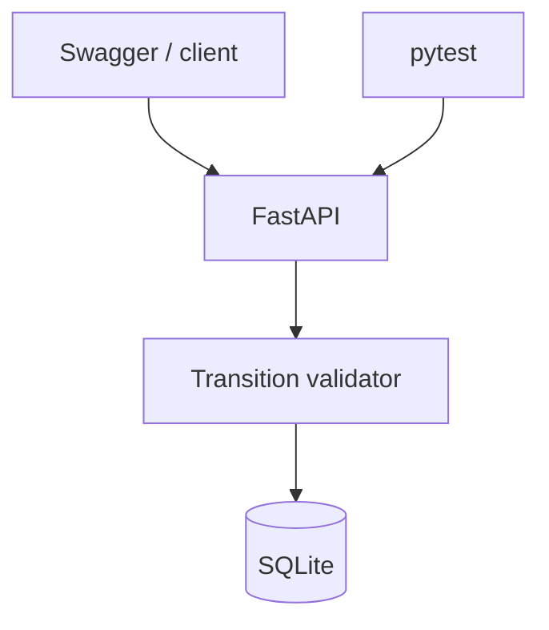

# Architecture minimale

- `app/main.py` expose les routes et la règle de transition.
- `app/database.py` initialise SQLite et applique une migration additive.
- `app/schemas.py` porte les contrats Pydantic.
- `tests/` prouve le comportement visible sans service externe.

Le projet reste volontairement mono-service : ajouter un front-end ou un orchestrateur ne rendrait pas l'hypothèse plus testable.

